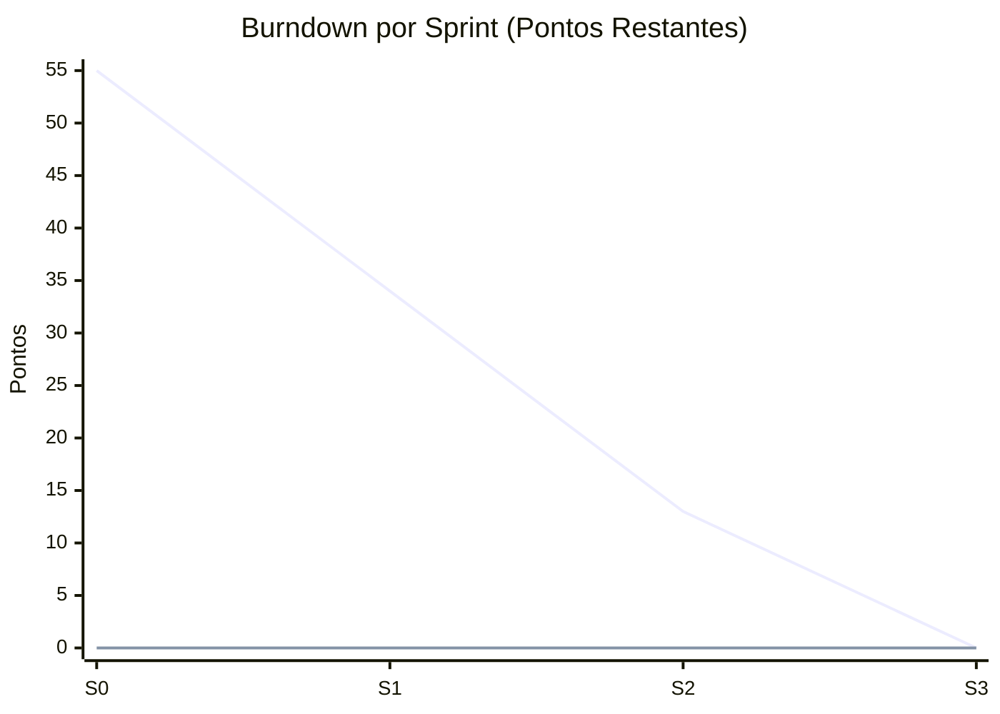

# Assistente de WhatsApp do Procon de Jacareí

## Visão Geral

Este projeto descreve a arquitetura de um **assistente de WhatsApp orientado a serviços**, desenvolvido para o **Procon de Jacareí**, com o objetivo de ampliar o acesso do cidadão aos serviços de orientação, triagem e encaminhamento relacionados à defesa do consumidor.

O assistente é projetado para receber mensagens, interpretar intenções, classificar contextos, gerar respostas e orquestrar fluxos de atendimento por meio de componentes desacoplados, mantendo foco em atendimento público, clareza das informações e rastreabilidade das interações.

A solução foi pensada para um cenário em que seja necessário combinar:

- automação de atendimento;
- interpretação de linguagem natural;
- classificação inteligente de mensagens;
- integração com canais externos;
- apoio ao atendimento ao cidadão;
- triagem de demandas de consumo;
- escalabilidade e independência entre módulos.

O sistema é dividido em três serviços principais:

- **Módulo de Geração de Texto**;
- **Observador do WhatsApp**;
- **Web Service de Orquestração**.

Além disso, a arquitetura incorpora uma **pipeline de PLN (Processamento de Linguagem Natural)** e um mecanismo de **mapeamento de classes com Machine Learning**, responsáveis por transformar mensagens brutas em intenções, categorias e ações de negócio.

---

## Contexto Institucional

O assistente foi idealizado para atender o **Procon de Jacareí**, servindo como um canal digital inicial para orientação ao consumidor, coleta de informações básicas e encaminhamento de solicitações.

Nesse contexto, o sistema deve apoiar atividades como:

- orientação sobre direitos do consumidor;
- triagem de reclamações e denúncias;
- esclarecimento sobre documentação necessária;
- apoio no agendamento ou direcionamento de atendimento;
- consulta de status de protocolos ou solicitações;
- encaminhamento para atendimento humano quando necessário.

O objetivo não é substituir integralmente o atendimento especializado do órgão, mas sim **agilizar o primeiro contato**, reduzir filas de dúvidas recorrentes e organizar melhor a entrada das demandas recebidas pelo WhatsApp.

---

## Objetivos

- Automatizar interações no WhatsApp com foco em atendimento ao cidadão e execução de serviços do Procon.
- Organizar a solução em componentes independentes e reutilizáveis.
- Permitir escalabilidade horizontal dos serviços.
- Facilitar manutenção, evolução e substituição de módulos.
- Aplicar PLN e Machine Learning para entendimento contextual das mensagens.
- Centralizar a orquestração das chamadas e regras de negócio em um serviço único.
- Apoiar a triagem inicial de demandas relacionadas à defesa do consumidor.
- Direcionar casos complexos para equipes humanas do Procon de Jacareí.

---

## Arquitetura da Solução

O projeto segue uma abordagem **SOA (Service-Oriented Architecture)**, na qual cada serviço tem responsabilidade bem definida e se comunica por APIs HTTP, mensageria ou eventos.

### Serviços Principais

#### 1. Observador do WhatsApp

Responsável por monitorar eventos do canal WhatsApp e transformar interações em entradas processáveis pelo restante da plataforma.

**Responsabilidades:**

- capturar mensagens recebidas;
- identificar metadados do remetente;
- registrar horário, sessão e contexto da conversa;
- encaminhar eventos ao Web Service de Orquestração;
- lidar com confirmações de entrega, leitura e falhas de envio;
- atuar como gateway entre o WhatsApp e a plataforma interna.

**Entradas típicas:**

- texto enviado pelo usuário;
- áudio transcrito;
- anexos com metadados;
- eventos de status da conversa.

**Saídas típicas:**

- payloads padronizados para o orquestrador;
- notificações de erro ou reconexão;
- eventos de auditoria.

#### 2. Web Service de Orquestração

É o núcleo da solução. Recebe os eventos do Observador do WhatsApp, coordena a pipeline de PLN, aciona o classificador de Machine Learning, consulta regras de negócio e decide qual serviço deverá ser chamado.

**Responsabilidades:**

- receber requisições externas e internas;
- validar payloads e autenticação;
- controlar o fluxo de processamento da mensagem;
- invocar a pipeline de PLN;
- solicitar classificação e mapeamento de classes;
- chamar o módulo de geração de texto;
- integrar com sistemas externos, banco de dados e APIs corporativas;
- retornar a resposta final para o canal de origem.

**Funções adicionais:**

- gestão de contexto de conversa;
- fallback para atendimento humano;
- rastreabilidade das decisões;
- logging e observabilidade;
- controle de versão de prompts, modelos e fluxos.

#### 3. Módulo de Geração de Texto

Responsável por construir a resposta textual do assistente com base na intenção detectada, no histórico da conversa e nas regras de negócio.

**Responsabilidades:**

- gerar respostas coerentes e contextualizadas;
- aplicar templates dinâmicos;
- enriquecer respostas com dados vindos de serviços externos;
- adaptar o tom de voz conforme o domínio do atendimento;
- produzir mensagens de confirmação, orientação, resumo e follow-up.

**Capacidades esperadas:**

- geração baseada em prompt;
- resposta guiada por contexto;
- uso de regras e validações antes do envio;
- suporte a fallback quando a confiança da classificação for baixa.

---

## Pipeline de PLN

A pipeline de PLN é responsável por transformar uma mensagem não estruturada em informação processável. Ela pode ser executada como parte do Web Service de Orquestração ou como um serviço separado.

### Etapas sugeridas

1. **Ingestão da mensagem**  
	 Recebimento do texto bruto vindo do WhatsApp.

2. **Normalização**  
	 Limpeza de caracteres, remoção de ruído, correção básica e padronização.

3. **Tokenização**  
	 Quebra do texto em unidades menores para análise.

4. **Lematização ou stemming**  
	 Redução de palavras às suas formas-base.

5. **Detecção de intenção**  
	Identificação do objetivo principal da mensagem, como relatar um problema de consumo, consultar protocolo, solicitar orientação, agendar atendimento ou pedir informações.

6. **Análise de contexto**  
	 Uso do histórico conversacional e estado da sessão para interpretar a mensagem corretamente.

7. **Análise de sentimento ou urgência**  
	 Classificação complementar para priorização ou roteamento.

8. **Preparação para classificação**  
	 Geração de features para o mecanismo de Machine Learning.

9. **Saída estruturada**  
		Produção de um objeto contendo intenção, nível de confiança, classe prevista e recomendação de ação.

### Exemplo de saída da pipeline

```json
{
	"mensagemOriginal": "Quero saber o andamento da minha reclamação 4589",
	"intencao": "consultar_reclamacao",
	"sentimento": "neutro",
	"classePrevista": "consulta_andamento_processo",
	"confianca": 0.94,
	"acaoSugerida": "consultar_api_protocolos"
}
```

---

## Mapeamento de Classes com Machine Learning

O sistema deve usar modelos de Machine Learning para classificar mensagens em classes de atendimento. Esse mapeamento ajuda o orquestrador a decidir qual fluxo executar.

### Finalidade

Converter mensagens de linguagem natural em **classes operacionais**, por exemplo:

- `orientacao_direitos_consumidor`;
- `abertura_reclamacao`;
- `consulta_andamento_processo`;
- `agendamento_atendimento`;
- `documentacao_necessaria`;
- `denuncia_estabelecimento`;
- `fallback_humano`.

### Fluxo de classificação

1. A mensagem é recebida pelo Observador do WhatsApp.
2. O Web Service chama a pipeline de PLN.
3. A pipeline produz features semânticas e contextuais.
4. O classificador prevê uma classe de negócio.
5. O orquestrador consulta o mapa de classes e decide a ação.
6. O Módulo de Geração de Texto constrói a resposta final.

### Estratégia de modelagem

O classificador pode ser treinado com dados históricos de conversas rotuladas. Dependendo da maturidade do projeto, podem ser utilizados:

- modelos tradicionais, como SVM, Random Forest e Naive Bayes;
- embeddings com classificadores supervisionados;
- transformers para classificação contextual;
- abordagens híbridas com regras + modelo estatístico.

### Estrutura de mapeamento sugerida

```json
{
	"consultar_reclamacao": {
		"classe": "consulta_andamento_processo",
		"acao": "consultar_api_protocolos",
		"prioridade": "media"
	},
	"abrir_reclamacao": {
		"classe": "abertura_reclamacao",
		"acao": "coletar_dados_consumidor",
		"prioridade": "alta"
	},
	"solicitar_orientacao": {
		"classe": "orientacao_direitos_consumidor",
		"acao": "fornecer_informacao_oficial",
		"prioridade": "media"
	}
}
```

### Critérios importantes

- limiar mínimo de confiança para resposta automática;
- fallback para humano em baixa confiança;
- versionamento dos modelos;
- monitoramento de drift;
- reentreinamento periódico;
- trilha de auditoria das previsões.

---

## Fluxo Geral de Atendimento

```text
Usuário -> WhatsApp -> Observador do WhatsApp -> Web Service de Orquestração
			 -> Pipeline de PLN -> Classificador de ML -> Regras de Negócio
			 -> Módulo de Geração de Texto -> Web Service -> WhatsApp -> Usuário
```

### Fluxo detalhado

1. O usuário envia uma mensagem pelo WhatsApp.
2. O Observador captura o evento e padroniza os dados.
3. O Web Service recebe o payload e inicia o processamento.
4. A pipeline de PLN extrai intenção e contexto.
5. O modelo de Machine Learning determina a classe da solicitação.
6. O orquestrador identifica qual ação ou serviço deve ser chamado.
7. Dados complementares são consultados, como protocolos, agenda de atendimento ou base de orientações.
8. O Módulo de Geração de Texto produz a resposta.
9. O Web Service devolve a mensagem para o Observador.
10. O Observador envia a resposta ao usuário no WhatsApp.

### Exemplos de demandas atendidas

- dúvidas sobre direitos do consumidor;
- abertura inicial de reclamações;
- consulta de andamento de protocolos;
- orientação sobre documentos necessários;
- encaminhamento para atendimento presencial ou humano;
- recebimento inicial de denúncias e relatos.

---

## Componentes Complementares

Embora os três serviços principais sejam o núcleo da solução, a arquitetura pode incluir módulos de apoio.

### Persistência

- histórico de conversas;
- sessões e contexto;
- logs de execução;
- resultados de classificação;
- auditoria de mensagens enviadas e recebidas.

### Observabilidade

- logs estruturados;
- métricas de latência;
- taxa de acerto da classificação;
- taxa de fallback humano;
- monitoramento de disponibilidade;
- rastreamento distribuído.

### Segurança

- autenticação entre serviços;
- autorização por escopo;
- criptografia de dados sensíveis;
- anonimização de dados para treinamento;
- conformidade com LGPD;
- controle de acesso a logs e modelos.
- aderência a políticas públicas e diretrizes institucionais do Procon.

---

## Endpoints Sugeridos do Web Service

Exemplo de endpoints que podem compor o serviço de orquestração:

### Receber evento do WhatsApp

```http
POST /api/whatsapp/events
```

### Processar mensagem

```http
POST /api/messages/process
```

### Consultar sessão

```http
GET /api/sessions/{sessionId}
```

### Classificar mensagem

```http
POST /api/ml/classify
```

### Gerar resposta textual

```http
POST /api/text/generate
```

### Health check

```http
GET /api/health
```

---

## Contrato de Mensagem Sugerido

```json
{
	"messageId": "msg-001",
	"channel": "whatsapp",
	"from": "+5511999999999",
	"timestamp": "2026-03-09T10:30:00Z",
	"content": {
		"type": "text",
	    "text": "Quero abrir uma reclamação contra uma loja que não entregou meu produto"
	},
	"context": {
		"sessionId": "session-123",
			"citizenId": "cid-456"
	}
}
```

---

## Requisitos Funcionais

- Receber mensagens do WhatsApp em tempo quase real.
- Identificar intenção e contexto por meio de PLN.
- Classificar mensagens em classes de atendimento do Procon com Machine Learning.
- Orquestrar chamadas entre os serviços internos.
- Gerar respostas automáticas contextualizadas para orientação inicial do cidadão.
- Registrar histórico, métricas e eventos operacionais.
- Permitir escalonamento para atendimento humano.
- Apoiar abertura de triagem, consulta de protocolos e orientação documental.

## Requisitos Não Funcionais

- Alta disponibilidade.
- Escalabilidade horizontal.
- Baixo acoplamento entre serviços.
- Segurança e proteção de dados.
- Rastreabilidade completa do processamento.
- Facilidade de manutenção e evolução.
- Clareza e linguagem acessível para atendimento público.

---

## Tecnologias Sugeridas

As tecnologias abaixo são apenas sugestões e podem ser adaptadas ao stack da equipe.

### Backend e APIs

- Node.js com NestJS ou Express;
- Python com FastAPI;
- Java com Spring Boot.

### PLN e Machine Learning

- spaCy;
- NLTK;
- Hugging Face Transformers;
- scikit-learn;
- TensorFlow ou PyTorch.

### Mensageria e Integração

- RabbitMQ;
- Apache Kafka;
- Redis Streams.

### Persistência

- PostgreSQL;
- MongoDB;
- Redis.

### Observabilidade

- Prometheus;
- Grafana;
- ELK Stack;
- OpenTelemetry.

---

## Exemplo de Organização de Pastas

```text
assistente-whatsapp/
├── docs/
├── services/
│   ├── whatsapp-observer/
│   ├── orchestrator-web-service/
│   └── text-generation-service/
├── ml/
│   ├── datasets/
│   ├── training/
│   ├── models/
│   └── class-mapping/
├── shared/
│   ├── contracts/
│   ├── schemas/
│   └── utils/
├── infra/
│   ├── docker/
│   ├── kubernetes/
│   └── monitoring/
└── README.md
```

---

## Estratégia de Evolução

### Fase 1

- integração básica com WhatsApp;
- orquestração inicial por regras;
- respostas com templates;
- logs e persistência mínima.

### Fase 2

- pipeline de PLN completa;
- classificador supervisionado;
- gestão de contexto de conversa;
- métricas de qualidade do atendimento.

### Fase 3

- personalização por perfil de cliente;
- recomendação de próxima ação;
- aprendizado contínuo com feedback humano;
- otimização de prompts e políticas de fallback.

---

## Benefícios da Arquitetura

- **Desacoplamento:** cada serviço evolui de forma independente.
- **Escalabilidade:** serviços críticos podem ser escalados separadamente.
- **Manutenibilidade:** responsabilidades bem definidas reduzem complexidade.
- **Inteligência operacional:** PLN e ML melhoram a precisão do atendimento.
- **Flexibilidade:** novos canais e serviços podem ser adicionados futuramente.

---

## Product Backlog (Inicial)

Backlog inicial para orientar a evolucao incremental do assistente de WhatsApp do Procon de Jacarei.

| ID | Item de backlog | Historia de usuario | Prioridade | Criterio de aceite | Status |
|---|---|---|---|---|---|
| PB-01 | Recebimento de mensagens WhatsApp | Como cidadao, quero enviar mensagens e receber confirmacao de recebimento para iniciar meu atendimento. | Alta | Mensagens de texto sao recebidas, registradas e respondidas com confirmacao em ate 5 segundos. | Pendente |
| PB-02 | Normalizacao e preprocessamento de texto | Como sistema, quero normalizar mensagens para reduzir ruido e melhorar a classificacao. | Alta | Pipeline aplica limpeza, tokenizacao e padronizacao antes da classificacao em 100% das mensagens validas. | Pendente |
| PB-03 | Classificacao de intencao com ML | Como atendente, quero que o sistema identifique a intencao principal da mensagem para rotear corretamente cada caso. | Alta | Classificador retorna intencao e confianca; quando confianca for menor que limiar definido, deve acionar fallback. | Pendente |
| PB-04 | Orquestracao de fluxos de atendimento | Como plataforma, quero decidir automaticamente a proxima acao com base em intencao, contexto e regras de negocio. | Alta | Orquestrador chama o servico correto por classe mapeada e registra trilha de decisao. | Pendente |
| PB-05 | Geracao de respostas contextualizadas | Como cidadao, quero receber orientacoes claras e objetivas de acordo com minha solicitacao. | Alta | Respostas sao geradas com contexto de sessao e seguem padrao de linguagem institucional. | Pendente |
| PB-06 | Escalonamento para atendimento humano | Como cidadao, quero ser encaminhado a um atendente quando o bot nao tiver confianca suficiente na resposta. | Alta | Casos de baixa confianca ou erro sao encaminhados para fila humana com contexto da conversa. | Pendente |
| PB-07 | Orientacao sobre documentacao necessaria | Como cidadao, quero saber quais documentos sao exigidos para cada tipo de reclamacao. | Media | Sistema retorna lista de documentos por tipo de demanda e orientacoes de envio. | Pendente |
| PB-08 | Seguranca e conformidade LGPD | Como instituicao, quero proteger dados pessoais e rastrear acessos para atender requisitos legais. | Alta | Dados sensiveis sao mascarados em logs; acessos e operacoes criticas ficam auditaveis. | Pendente |
| PB-09 | Base de conhecimento institucional | Como sistema, quero consultar conteudo oficial do Procon para responder com informacoes atualizadas. | Media | Respostas de orientacao referenciam base validada e exibem data de atualizacao do conteudo. | Pendente |
| PB-10 | Agendamento online de atendimento | Como cidadao, quero agendar atendimento online para ser atendido sem precisar ir presencialmente ao Procon. | Baixa | Sistema oferece fluxo de agendamento online com escolha de data e horario, confirmando o agendamento ao final. | Pendente |

### Criterios de priorizacao

- impacto no cidadao e no atendimento publico;
- risco operacional e juridico;
- dependencia tecnica entre servicos;
- ganho de valor nas primeiras entregas.

### Planejamento em 3 sprints (com pontuacao)

### Sprint 1 - Fundacao do atendimento (21 pontos)

| ID | Item | Pontos |
|---|---|---|
| PB-01 | Recebimento de mensagens WhatsApp | 5 |
| PB-02 | Normalizacao e preprocessamento de texto | 3 |
| PB-04 | Orquestracao de fluxos de atendimento | 8 |
| PB-05 | Geracao de respostas contextualizadas | 5 |

### Sprint 2 - Inteligencia e governanca (21 pontos)

| ID | Item | Pontos |
|---|---|---|
| PB-03 | Classificacao de intencao com ML | 8 |
| PB-06 | Escalonamento para atendimento humano | 5 |
| PB-08 | Seguranca e conformidade LGPD | 5 |
| PB-07 | Orientacao sobre documentacao necessaria | 3 |

### Sprint 3 - Expansao de servicos (13 pontos)

| ID | Item | Pontos |
|---|---|---|
| PB-09 | Base de conhecimento institucional | 5 |
| PB-10 | Agendamento online de atendimento | 8 |

### Escala de pontuacao utilizada

- 3 pontos: baixa complexidade;
- 5 pontos: media complexidade;
- 8 pontos: alta complexidade;
- 13 pontos: muito alta complexidade.

### Burndown das entregas

Total planejado do backlog atual: **55 pontos**.

#### Burndown geral por sprint

| Marco | Pontos planejados restantes | Pontos reais restantes | Entregas concluidas | Data da atualizacao |
|---|---:|---:|---:|---|
| Inicio (Kickoff) | 55 | 55 | 0/10 | 16-03-2026 |
| Fim Sprint 1 | 0 | 0 | 0/10 | A preencher |
| Fim Sprint 2 | 0 | 0 | 0/10 | A preencher |
| Fim Sprint 3 | 0 | 0 | 0/10 | A preencher |

#### Grafico burndown



##### Sprint 1 (21 pontos)

| Checkpoint | Planejado restante | Real restante | Observacoes |
|---|---:|---:|---|
| D0 | 21 | 21 | Inicio da sprint |
| D1 | 16 | A preencher | |
| D2 | 11 | A preencher | |
| D3 | 6 | A preencher | |
| D4 | 0 | A preencher | Encerramento |

##### Sprint 2 (21 pontos)

| Checkpoint | Planejado restante | Real restante | Observacoes |
|---|---:|---:|---|
| D0 | 21 | 21 | Inicio da sprint |
| D1 | 16 | A preencher | |
| D2 | 11 | A preencher | |
| D3 | 6 | A preencher | |
| D4 | 0 | A preencher | Encerramento |

##### Sprint 3 (13 pontos)

| Checkpoint | Planejado restante | Real restante | Observacoes |
|---|---:|---:|---|
| D0 | 13 | 13 | Inicio da sprint |
| D1 | 10 | A preencher | |
| D2 | 7 | A preencher | |
| D3 | 3 | A preencher | |
| D4 | 0 | A preencher | Encerramento |


<!--#### Regra de atualizacao
- ao concluir uma historia, subtraia seus pontos do campo "Real restante";
- atualize o marco de fim da sprint no quadro geral;
- replique os numeros no grafico Mermaid (serie `real`) para manter o visual sincronizado.
-->

---

## Resumo

Este repositório documenta uma proposta de **assistente de WhatsApp orientado a serviços**, composta por um **Observador do WhatsApp**, um **Web Service de Orquestração** e um **Módulo de Geração de Texto**, enriquecidos por uma **pipeline de PLN** e por **mapeamento de classes com Machine Learning**.

A arquitetura busca equilibrar automação, inteligência e governança, permitindo que o **Procon de Jacareí** interprete mensagens, classifique demandas de consumidores, acione serviços corretos e responda com contexto, consistência e escalabilidade.
