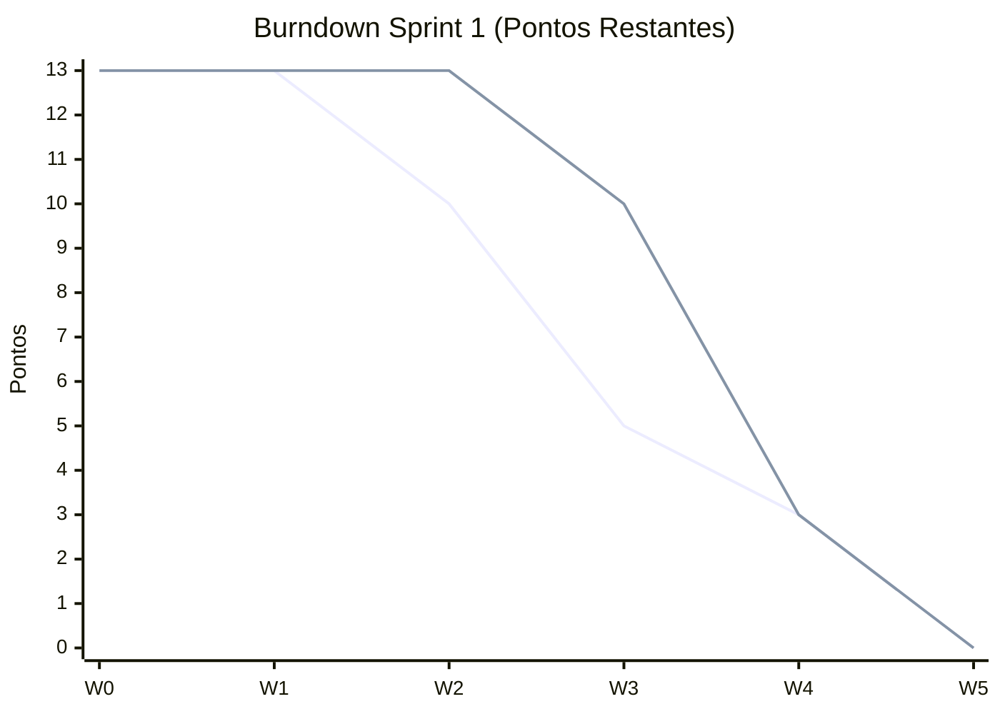
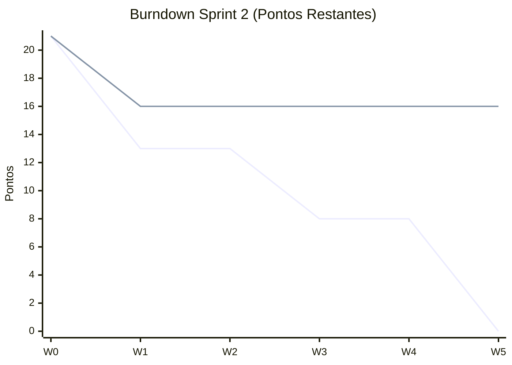
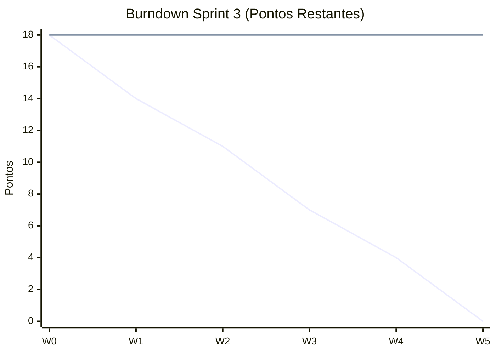

# Assistente de WhatsApp do Procon de Jacareí

## Visão geral

Este repositório documenta uma proposta de **assistente de WhatsApp** para o **Procon de Jacareí**, voltado ao **primeiro atendimento** do cidadão: orientação, triagem e encaminhamento.

O foco é automatizar o que for repetitivo, mantendo **clareza**, **rastreabilidade** e **fallback para atendimento humano** quando necessário.

## Escopo (resumo)

- orientar sobre direitos do consumidor e documentação;
- triagem inicial de reclamações/denúncias;
- direcionamento para serviços/fluxos internos;
- consulta de status/protocolo (quando houver integração);
- encaminhamento para humano em baixa confiança.

---

## Pipeline de PLN

A pipeline de PLN é responsável por transformar uma mensagem não estruturada em informação processável. Ela pode ser executada como parte do Web Service de Orquestração ou como um serviço separado.

### Saída esperada (exemplo)

Em alto nível, a saída deve incluir **intenção/classe** e um nível de **confiança**, para orientar o roteamento (resposta automática vs. pedir esclarecimento vs. humano).

```json
{
	"mensagemOriginal": "Quero saber o andamento da minha reclamação 4589",
	"intencao": "consultar_reclamacao",
	"sentimento": "neutro",
	"classePrevista": "consulta_andamento_processo",
	"confianca": 0.94,
	"acaoSugerida": "consultar_api_protocolos"
}
```

---

## Fluxo Geral de Atendimento

```text
Usuário -> WhatsApp -> Observador do WhatsApp -> Web Service de Orquestração
			 -> Pipeline de PLN -> Classificador de ML -> Regras de Negócio
			 -> Módulo de Geração de Texto -> Web Service -> WhatsApp -> Usuário
```

Em geral:

1. recebe a mensagem;
2. normaliza/processa (PLN);
3. classifica e aplica regras;
4. gera resposta;
5. envia de volta ao usuário.

---

## Requisitos (resumo)

- Atendimento inicial com linguagem clara e acessível.
- Roteamento por confiança (automático vs. humano).
- Rastreabilidade (histórico, logs e trilha de decisão).
- Segurança e conformidade (LGPD) para dados sensíveis.
- Escalabilidade e baixo acoplamento entre módulos.

---

## Product Backlog (Inicial)

Backlog inicial para orientar a evolucao incremental do assistente de WhatsApp do Procon de Jacareí.

| ID | Item de backlog | Historia de usuario | Prioridade | Criterio de aceite | Status |
|---|---|---|---|---|---|
| PB-01 | Recebimento de mensagens WhatsApp | Como cidadao, quero enviar mensagens e receber confirmacao de recebimento para iniciar meu atendimento. | Alta | Mensagens de texto sao recebidas, registradas e respondidas com confirmacao em ate 5 segundos. | Concluido |
| PB-02 | Normalizacao e preprocessamento de texto | Como sistema, quero normalizar mensagens para reduzir ruido e melhorar a classificacao. | Alta | Pipeline aplica limpeza, tokenizacao e padronizacao antes da classificacao em 100% das mensagens validas. | Concluido |
| PB-03 | Geracao de respostas pre designadas | Como cidadao, quero receber respostas iniciais padronizadas para obter orientacao imediata no primeiro contato. | Alta | Sistema responde com templates validados por tipo de solicitacao e registra o envio no historico da conversa. | Concluido |
| PB-04 | Orquestracao de fluxos de atendimento | Como plataforma, quero decidir automaticamente a proxima acao com base em intencao, contexto e regras de negocio. | Alta | Orquestrador chama o servico correto por classe mapeada e registra trilha de decisao. | Pendente |
| PB-05 | Classificacao de intencao com ML | Como atendente, quero que o sistema identifique a intencao principal da mensagem para rotear corretamente cada caso. | Alta | Classificador retorna intencao e confianca; quando confianca for menor que limiar definido, deve acionar fallback. | Pendente |
| PB-06 | Base de conhecimento institucional | Como sistema, quero consultar conteudo oficial do Procon para responder com informacoes atualizadas. | Media | Respostas de orientacao referenciam base validada e exibem data de atualizacao do conteudo. | Concluido |
| PB-07 | Escalonamento para atendimento humano | Como cidadao, quero ser encaminhado a um atendente quando o bot nao tiver confianca suficiente na resposta. | Media | Casos de baixa confianca ou erro sao encaminhados para fila humana com contexto da conversa. | Pendente |
| PB-08 | Seguranca e conformidade LGPD | Como instituicao, quero proteger dados pessoais e rastrear acessos para atender requisitos legais. | Alta | Dados sensiveis sao mascarados em logs; acessos e operacoes criticas ficam auditaveis. | Pendente |
| PB-09 | Agendamento online de atendimento | Como cidadao, quero agendar atendimento online para ser atendido sem precisar ir presencialmente ao Procon. | Baixa | Sistema oferece fluxo de agendamento online com escolha de data e horario, confirmando o agendamento ao final. | Pendente |

### Criterios de priorizacao

- impacto no cidadao e no atendimento publico;
- risco operacional e juridico;
- dependencia tecnica entre servicos;
- ganho de valor nas primeiras entregas.

### Planejamento em 3 sprints (com pontuacao)

### Sprint 1 - Fundacao do atendimento (13 pontos)

| ID | Item | Pontos |
|---|---|---|
| PB-01 | Recebimento de mensagens WhatsApp | 5 |
| PB-02 | Normalizacao e preprocessamento de texto | 3 |
| PB-03 | Geracao de respostas pré designadas | 5 |

### Sprint 2 - Inteligencia e governanca (21 pontos)

| ID | Item | Pontos |
|---|---|---|
| PB-04 | Orquestracao de fluxos de atendimento | 8 |
| PB-05 | Classificacao de intencao com ML | 8 |
| PB-06 | Base de conhecimento institucional | 5 |

### Sprint 3 - Expansao de servicos (18 pontos)

| ID | Item | Pontos |
|---|---|---|
| PB-07 | Escalonamento para atendimento humano | 5 |
| PB-08 | Seguranca e conformidade LGPD | 5 |
| PB-09 | Agendamento online de atendimento | 8 |

### Escala de pontuacao utilizada

- 3 pontos: baixa complexidade;
- 5 pontos: media complexidade;
- 8 pontos: alta complexidade;

### Burndown das entregas

Total planejado do backlog atual: **52 pontos**.

#### Burndown geral por sprint

| Marco | Pontos planejados restantes | Pontos reais restantes | Entregas concluidas | Data da atualizacao |
|---|---:|---:|---:|---|
| Inicio (Kickoff) | 52 | 52 | 0/9 | 16-03-2026 |
| Fim Sprint 1 | 13 | 0 | 3/3 | 28-04-2026 |
| Fim Sprint 2 | 21 | 16 | 1/3 | A preencher |
| Fim Sprint 3 | 18 | 18 | 0/3 | A preencher |

#### Grafico burndown

##### Sprint 1



##### Sprint 2



##### Sprint 3



<!--#### Regra de atualizacao
- ao concluir uma historia, subtraia seus pontos do campo "Real restante";
- atualize o marco de fim da sprint no quadro geral;
- replique os numeros no grafico Mermaid (serie `real`) para manter o visual sincronizado.
-->

---

## Resumo

Proposta de assistente de WhatsApp para o **Procon de Jacareí**, com triagem e orientação no primeiro contato, evoluindo de forma incremental conforme o backlog e as metas de burndown.
