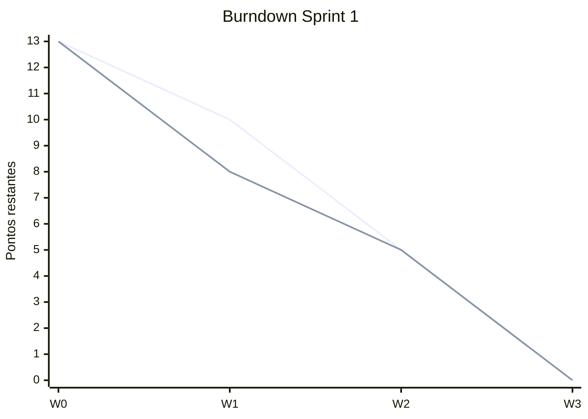
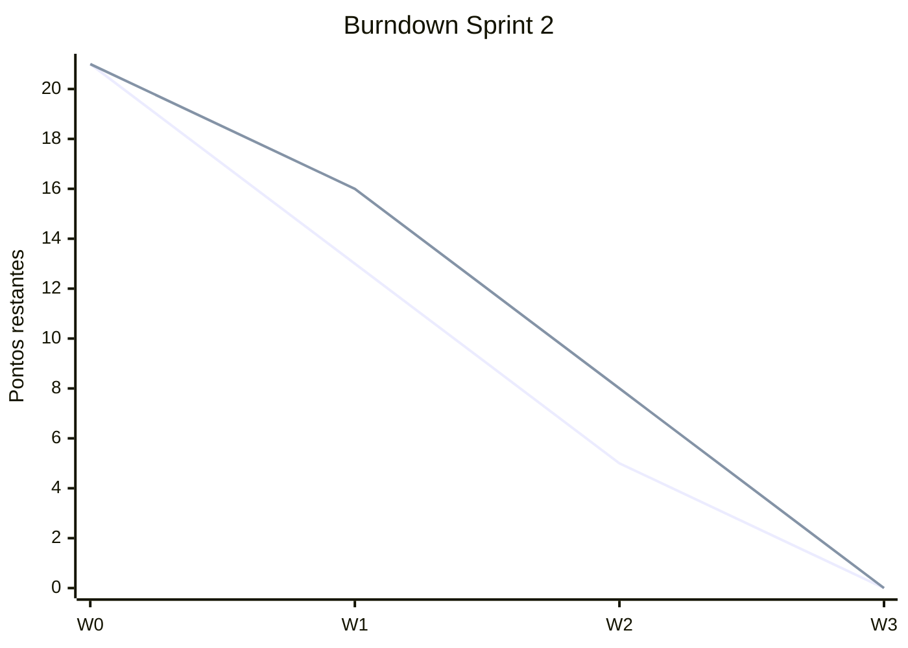
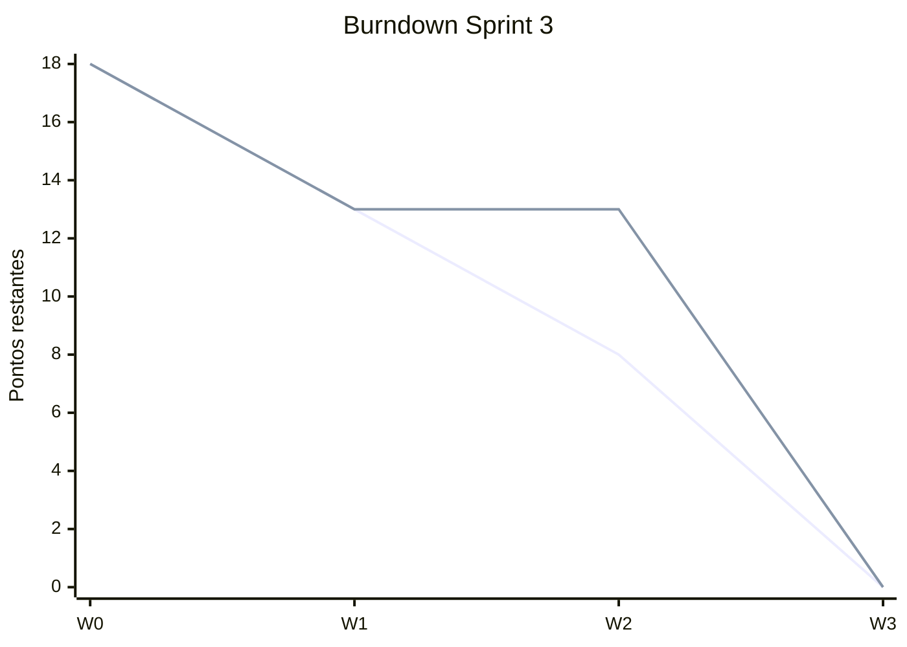

# Assistente de WhatsApp do Procon de Jacareí

## Visão geral

Este repositório documenta uma proposta de **assistente de WhatsApp** para o **Procon de Jacareí**, voltado ao **primeiro atendimento** do cidadão: orientação, triagem e encaminhamento.

O foco é automatizar o que for repetitivo, mantendo **clareza**, **rastreabilidade** e **fallback para atendimento humano** quando necessário.

### Documentação relacionada

- [Instruções de execução e referência técnica do backend](https://github.com/candago-6/backend/blob/main/README.md)
- [Feedback do cliente - Sprint 2](docs/Candango_Sprint2.pdf)

### Equipe e papéis

| Integrante | Papel |
|---|---|
| Caique Moura | Scrum Master |
| Luis Gustavo de Souza Barbosa Pereira | Product Owner |
| Guilherme Cardoso | Desenvolvedor |
| Lucas Jaques de Souza | Desenvolvedor |
| Lucas Rafael Marcondes de Assis | Desenvolvedor |
| Rafael Soares | Desenvolvedor |

## Escopo (resumo)

- orientar sobre direitos do consumidor e documentação;
- triagem inicial de reclamações/denúncias;
- direcionamento para serviços/fluxos internos;
- consulta de status/protocolo (quando houver integração);
- encaminhamento para humano em baixa confiança.
- evolução do dataset de treinamento a partir de respostas corretas validadas.

---

## Pipeline de PLN / Geração de texto

A pipeline de PLN é responsável por transformar uma mensagem não estruturada em informação processável. Ela pode ser executada como parte do Web Service de Orquestração ou como um serviço separado.

### Saída esperada

Em alto nível, a saída deve incluir **intenção/classe** e um nível de **confiança**, para orientar o roteamento (resposta automática vs. pedir esclarecimento vs. humano).

---

## Fluxo Geral de Atendimento

```text
Usuário -> WhatsApp -> Observador do WhatsApp -> Web Service de Orquestração
			 -> Pipeline de PLN -> Classificador de ML -> Regras de Negócio
			 -> Módulo de Geração de Texto -> Web Service -> WhatsApp -> Usuário
```

Em geral:

1. recebe a mensagem;
2. normaliza/processa (PLN);
3. classifica e aplica regras;
4. gera resposta;
5. envia de volta ao usuário.

---

## Requisitos do projeto

| ID | Requisito |
|---|---|
| REQ-01 | Realizar o atendimento inicial com linguagem clara e acessível. |
| REQ-02 | Classificar mensagens e rotear o atendimento conforme o nível de confiança. |
| REQ-03 | Orquestrar os fluxos entre o WhatsApp, as regras de negócio e a pipeline de PLN. |
| REQ-04 | Responder com base em conteúdo institucional validado. |
| REQ-05 | Encaminhar para atendimento humano em casos de baixa confiança ou erro. |
| REQ-06 | Manter histórico, logs e trilha de decisão auditável. |
| REQ-07 | Proteger dados sensíveis e atender aos princípios da LGPD. |
| REQ-08 | Permitir a evolução dos módulos com baixo acoplamento. |
| REQ-09 | Garantir o autoaprendizado a partir de perguntas dos usuários e respostas marcadas como corretas, mapeando-as para o dataset de treinamento do DistilBERT. |

---

## Decisões técnicas

| Decisão | Justificativa | Consequências e cuidados |
|---|---|---|
| Separar WhatsApp, orquestração e PLN em serviços | Isola responsabilidades e permite evoluir cada componente com menor impacto nos demais. | Exige contratos de API estáveis, tratamento de indisponibilidade e observabilidade entre serviços. |
| Usar APIs HTTP/JSON entre os serviços | Facilita integração, testes e substituição de componentes escritos em tecnologias diferentes. | Os payloads devem ser validados, versionados e limitar a exposição de dados pessoais. |
| Usar Python/FastAPI na orquestração e PLN e Node.js no adaptador do WhatsApp | Aproveita o ecossistema Python de aprendizado de máquina e a integração do `whatsapp-web.js` com o canal. | Dependências, sessão do WhatsApp, latência e limitações da plataforma devem ser monitoradas. |
| Executar o ambiente com Docker Compose e PostgreSQL | Padroniza a execução dos serviços e oferece persistência relacional para dados operacionais. | Credenciais padrão devem ser substituídas; backup, retenção e controle de acesso devem ser definidos. |
| Manter estratégias de PLN intercambiáveis | Permite comparar FastText, Word2Vec/KNN, DistilBERT e RAG antes da adoção no fluxo principal. | A escolha deve usar métricas reproduzíveis de qualidade, confiança, latência e custo. |
| Priorizar respostas controladas e fallback humano | Reduz o risco de orientação incorreta em casos ambíguos ou sensíveis. | O sistema deve registrar a decisão e encaminhar casos abaixo do limiar definido. |
| Validar exemplos antes de incorporá-los ao dataset | Evita que avaliações incorretas ou maliciosas prejudiquem o treinamento do DistilBERT. | Pergunta, resposta correta, intenção, origem e aprovação devem permanecer auditáveis antes do retreinamento. |

As decisões devem ser revisadas quando houver mudança de escopo, legislação, provedor do WhatsApp, volume de atendimento ou resultados dos modelos de PLN.

---

## Product Backlog

Backlog inicial para orientar a evolucao incremental do assistente de WhatsApp do Procon de Jacareí.

| ID | Item de backlog | Historia de usuario | Prioridade | Criterio de aceite |
|---|---|---|---|---|
| PB-01 | Recebimento de mensagens WhatsApp | Como cidadao, quero enviar mensagens e receber confirmacao de recebimento para iniciar meu atendimento. | Alta | Mensagens de texto sao recebidas, registradas e respondidas com confirmacao em ate 5 segundos. |
| PB-02 | Normalizacao e preprocessamento de texto | Como sistema, quero normalizar mensagens para reduzir ruido e melhorar a classificacao. | Alta | Pipeline aplica limpeza, tokenizacao e padronizacao antes da classificacao em 100% das mensagens validas. |
| PB-03 | Geracao de respostas pre designadas | Como cidadao, quero receber respostas iniciais padronizadas para obter orientacao imediata no primeiro contato. | Alta | Sistema responde com templates validados por tipo de solicitacao e registra o envio no historico da conversa. |
| PB-04 | Orquestracao de fluxos de atendimento | Como plataforma, quero decidir automaticamente a proxima acao com base em intencao, contexto e regras de negocio. | Alta | Orquestrador chama o servico correto por classe mapeada e registra trilha de decisao. |
| PB-05 | Classificacao de intencao com ML | Como atendente, quero que o sistema identifique a intencao principal da mensagem para rotear corretamente cada caso. | Alta | Classificador retorna intencao e confianca; quando confianca for menor que limiar definido, deve acionar fallback. |
| PB-06 | Base de conhecimento institucional | Como sistema, quero consultar conteudo oficial do Procon para responder com informacoes atualizadas. | Media | Respostas de orientacao referenciam base validada e exibem data de atualizacao do conteudo. |
| PB-07 | Escalonamento para atendimento humano | Como cidadao, quero ser encaminhado a um atendente quando o bot nao tiver confianca suficiente na resposta. | Media | Casos de baixa confianca ou erro sao encaminhados para fila humana com contexto da conversa. |
| PB-08 | Seguranca e conformidade LGPD | Como instituicao, quero proteger dados pessoais e rastrear acessos para atender requisitos legais. | Alta | Dados sensiveis sao mascarados em logs; acessos e operacoes criticas ficam auditaveis. |
| PB-09 | Autoaprendizado do DistilBERT | Como equipe do Procon, quero transformar perguntas dos usuários e respostas marcadas como corretas em exemplos de treinamento para melhorar continuamente a classificação. | Media | Ao marcar uma resposta como correta, o sistema relaciona pergunta, resposta e intenção; registra origem e aprovação; adiciona o exemplo validado ao dataset do DistilBERT sem duplicação; e mantém evidência auditável da atualização. |

### Matriz de rastreabilidade

A matriz conecta requisitos, histórias, planejamento e evidências técnicas. Para completar a rastreabilidade no GitHub Projects, toda task deve conter o ID do backlog no título ou na descrição, por exemplo: `[05.1] Avaliar classificador DistilBERT`.

| Requisito | Product Backlog | Sprint | Evidência atual | Status |
|---|---|---|---|---|
| REQ-01 | PB-01, PB-03 | Sprint 1 | `whatsapp_bot/index.js`; `pln_pipeline/app/utils/item_responses.json` | Concluído |
| REQ-02 | PB-02, PB-05 | Sprints 1 e 2 | `pln_pipeline/app/models/preprocessing.py`; endpoints e testes de classificação | Concluído |
| REQ-03, REQ-08 | PB-04 | Sprint 2 | `docker-compose.yml`; `service_manager`; integração entre bot e PLN | Concluído |
| REQ-04 | PB-06 | Sprint 2 | base de FAQ, endpoints RAG e respostas institucionais | Concluído |
| REQ-05 | PB-07 | Sprint 3 | estados `waiting_human` e `human_handover` no backend | Concluído |
| REQ-06, REQ-07 | PB-08 | Sprint 3 | persistência de conversas; autenticação; criptografia de CPF | Concluído |
| REQ-09 | PB-09 | Sprint 3 | feedback e marcação de melhor resposta já são persistidos; mapeados exemplos validados para o dataset do DistilBERT | Concluído |

Regras de rastreabilidade:

- tasks e PRs devem citar pelo menos um PB ID `XX`;
- critérios de aceite da história devem aparecer na task ou Issue relacionada;
- PRs devem informar evidências de teste e atualizar a documentação afetada;
- a história só pode ser concluída após atender à Definition of Done.

### Criterios de priorizacao

- impacto no cidadão e no atendimento publico;
- risco operacional e juridico;
- dependencia tecnica entre servicos;
- ganho de valor nas primeiras entregas.

### Planejamento em 3 sprints (com pontuacao)

### Sprint 1 - Fundação do atendimento (13 pontos)

| ID | Item | Pontos |
|---|---|---|
| PB-01 | Recebimento de mensagens WhatsApp | 5 |
| PB-02 | Normalizacao e preprocessamento de texto | 3 |
| PB-03 | Geracao de respostas pré designadas | 5 |

### Sprint 2 - Inteligencia e governanca (21 pontos)

| ID | Item | Pontos |
|---|---|---|
| PB-04 | Orquestracao de fluxos de atendimento | 8 |
| PB-05 | Classificacao de intencao com ML | 8 |
| PB-06 | Base de conhecimento institucional | 5 |

### Sprint 3 - Expansao e aprendizado continuo (18 pontos)

| ID | Item | Pontos |
|---|---|---|
| PB-07 | Escalonamento para atendimento humano | 5 |
| PB-08 | Seguranca e conformidade LGPD | 5 |
| PB-09 | Autoaprendizado do DistilBERT | 8 |

### Escala de pontuacao utilizada

- 3 pontos: baixa complexidade;
- 5 pontos: media complexidade;
- 8 pontos: alta complexidade;

### Definition of Done (DoD)

Uma história ou task é considerada concluída somente quando:

- os critérios de aceite relacionados foram atendidos;
- a implementação foi integrada à branch principal por Pull Request revisado;
- testes relevantes foram executados e as evidências registradas no PR;
- não há erro conhecido que impeça o fluxo principal da funcionalidade;
- documentação, contratos de API e variáveis de ambiente afetados foram atualizados;
- requisitos de segurança e privacidade aplicáveis foram verificados;
- a task, o PR e os commits possuem referência ao PB ID `XX`;
- o status da história e o burndown foram atualizados.

### Burndown das entregas

Total planejado do backlog atual: **52 pontos**. Total concluído: **44 pontos**.

**Origem dos dados:** pontos das histórias do Product Backlog. O burndown considera uma história concluída somente após o atendimento da DoD; tasks internas do GitHub Projects não alteram diretamente a pontuação. Cada queda semanal corresponde à conclusão integral de uma história de `3`, `5` ou `8` pontos.

#### Resumo por Sprint

| Sprint | Pontos planejados | Pontos concluídos | Pontos restantes | Histórias concluídas | Situação |
|---|---:|---:|---:|---:|---|
| Sprint 1 | 13 | 13 | 0 | 3/3 | Concluída |
| Sprint 2 | 21 | 21 | 0 | 3/3 | Concluída |
| Sprint 3 | 18 | 18 | 0 | 3/3 | Concluída |

#### Burndown Sprint 1


```mermaid
xychart-beta
	title "Burndown Sprint 1"
	x-axis [W0, W1, W2, W3]
	y-axis "Pontos restantes" 0 --> 13
	line "planejado" [13, 10, 5, 0]
	line "real" [13, 8, 5, 0]
```

#### Burndown Sprint 2


```mermaid
xychart-beta
	title "Burndown Sprint 2"
	x-axis [W0, W1, W2, W3]
	y-axis "Pontos restantes" 0 --> 21
	line "planejado" [21, 13, 5, 0]
	line "real" [21, 16, 8, 0]
```

#### Burndown Sprint 3


```mermaid
xychart-beta
	title "Burndown Sprint 3"
	x-axis [W0, W1, W2, W3]
	y-axis "Pontos restantes" 0 --> 18
	line "planejado" [18, 13, 8, 0]
	line "real" [18, 13, 13, 0]
```

---

## Sprint 2 - Review

### Entregas e evidências

- base de conhecimento institucional concluída;
- pipeline de PLN e alternativas de classificação concluídas para o escopo da Sprint 2;
- ambiente executável com Docker Compose e serviços separados;
- Kanban, tasks, PRs e commits utilizados como evidência de execução;
- burndown da Sprint 2 documentado.

### Feedback do cliente sobre o projeto

- manter a arquitetura e a organização do backlog, avaliadas positivamente;
- formalizar a Definition of Done;
- melhorar a rastreabilidade entre requisitos, histórias, tasks e PRs;
- informar a origem dos dados do burndown;
- separar formalmente Sprint Review e Sprint Retrospective.

Fonte: [Avaliação da Sprint 2](docs/Candango_Sprint2.pdf). As avaliações individuais não fazem parte deste registro.

## Sprint 2 - Retrospective

### O que funcionou

- uso efetivo do GitHub Projects e do Kanban;
- evolução de documentação para execução técnica rastreável;
- separação dos serviços e arquitetura coerente com o problema;
- backlog e planejamento alinhados ao objetivo da Sprint.

### O que precisa melhorar

- relacionar todas as tasks e PRs aos IDs do Product Backlog;
- validar a DoD antes de mover uma história para concluída;
- manter o burndown sincronizado com o GitHub Projects;
- registrar Review e Retrospective separadamente ao final de cada Sprint.

### Ações para a próxima Sprint

| Ação | Critério de conclusão |
|---|---|
| Aplicar IDs `PB-XX` nas tasks e PRs | 100% dos novos itens da Sprint 3 possuem referência ao backlog. |
| Usar a DoD no encerramento das histórias | Toda história concluída possui checklist e evidências no PR. |
| Atualizar o burndown a partir do GitHub Projects | Gráfico e tabela atualizados semanalmente e na Review. |
| Registrar Review e Retrospective | Os dois eventos possuem seções distintas com resultados e ações. |

---

## Resumo

Proposta de assistente de WhatsApp para o **Procon de Jacareí**, com triagem e orientação no primeiro contato, evoluindo de forma incremental conforme o backlog e as metas de burndown.
